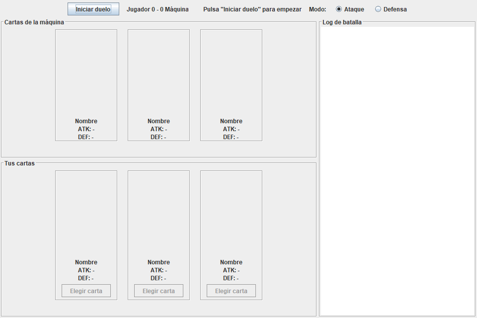
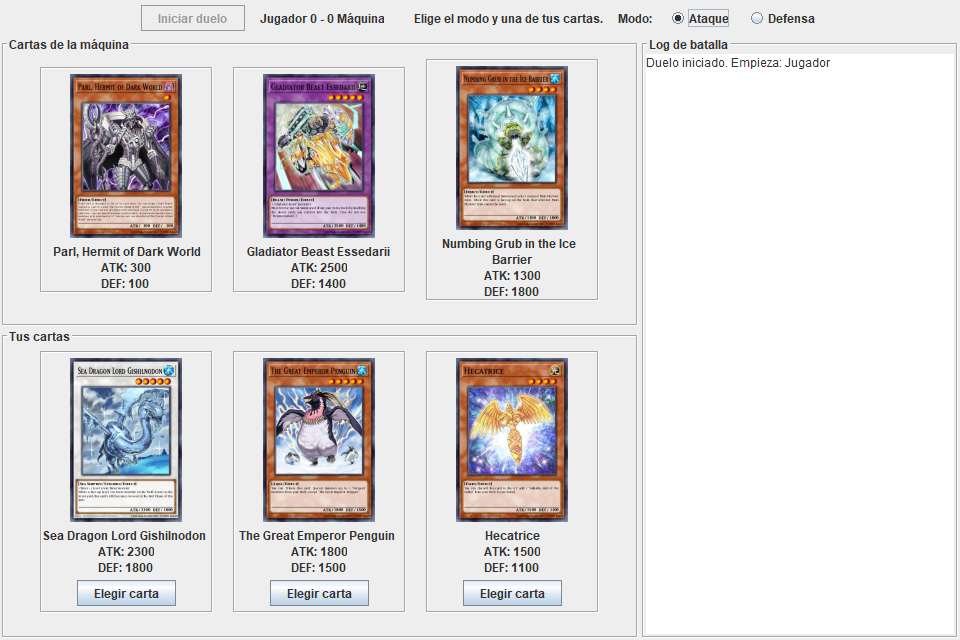
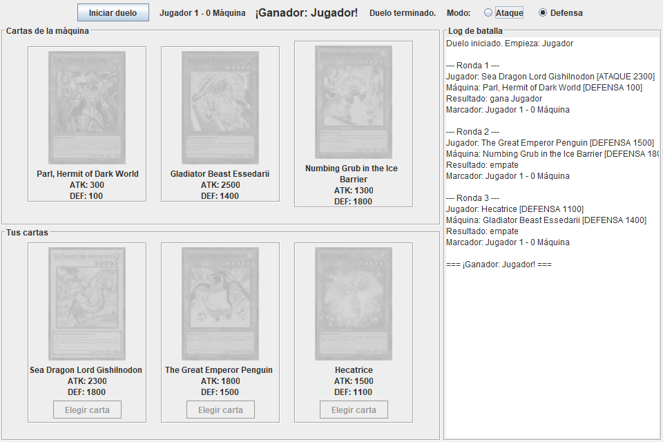

# Yu-Gi-Oh! Duel Lite

Mini-aplicación de escritorio en **Java Swing** que simula un duelo sencillo de Yu-Gi-Oh! entre el jugador y la máquina, usando cartas obtenidas en vivo desde la API [YGOProDeck](https://db.ygoprodeck.com/api-guide/). Cada bando recibe 3 cartas Monster al azar y gana el primero que consiga 2 rondas.

## Instrucciones de ejecución

### Requisitos
- Java 11 o superior (JDK).
- Maven 3.6 o superior (o IntelliJ IDEA, que ya lo incluye).
- Conexión a internet (las cartas y sus imágenes se descargan de la API).

### Desde la terminal (Maven)
En la carpeta del proyecto:

```bash
mvn compile exec:java
```

### Desde IntelliJ IDEA
1. **File → Open**, seleccionar el archivo `pom.xml` y elegir **Open as Project**.
2. Esperar a que Maven descargue las dependencias (`org.json`).
3. Abrir `src/main/java/yugioh/Main.java` y pulsar ▶ (Run).

> Para modificar la interfaz con el diseñador visual (`.form`), configurar en
> **Settings → Editor → GUI Designer**: *Generate GUI into* = **Java source code on form save**.
> Así el código de la interfaz queda en los `.java` y el proyecto compila con Maven.

### Cómo jugar
1. Pulsar **Iniciar duelo**: se cargan las 3 cartas del jugador y las 3 de la máquina.
2. Elegir el modo (**Ataque** o **Defensa**) y pulsar **Elegir carta** en una de tus cartas.
3. La máquina juega una carta y un modo al azar; el resultado y el marcador aparecen en el **Log de batalla**.
4. Gana el duelo quien obtenga primero **2 rondas**.

Reglas de cada ronda: si ambos atacan gana el mayor ATK; si uno ataca y el otro defiende se compara el ATK del atacante contra la DEF del defensor; si ambos defienden, o los valores son iguales, la ronda es empate.

## Diseño

El proyecto está organizado en paquetes con responsabilidades separadas: `model` (`Card`, datos de la carta), `api` (`YgoApiClient`, consume `randomcard.php` con `java.net.http.HttpClient`, parsea el JSON con `org.json` y vuelve a pedir carta hasta obtener un Monster con ATK y DEF válidos), `logic` (`Duel`, reglas del enfrentamiento, sin ninguna dependencia de Swing), `listener` (`BattleListener`, interfaz con `onTurn`, `onScoreChanged` y `onDuelEnded`) y `ui` (`MainWindow` y `CardPanel`). La lógica y la interfaz están desacopladas mediante el `BattleListener`: `Duel` solo notifica los eventos de la partida y `MainWindow`, que implementa la interfaz, se encarga de pintarlos en pantalla.

La interfaz se diseñó con el GUI Designer de IntelliJ (`MainWindow.form` y `CardPanel.form`); cada carta es un `CardPanel` reutilizado seis veces. Los botones **Iniciar duelo** y **Elegir carta** usan `ActionListener`. Para no bloquear el hilo de la UI, la descarga de las 6 cartas y sus imágenes se hace en segundo plano con un `SwingWorker` (en paralelo), y el duelo no se habilita hasta que ambos bandos tienen sus 3 cartas cargadas. Los errores se muestran en pantalla ("No se pudo cargar la carta", "error de red").

## Capturas de pantalla

**Pantalla inicial**



**Cartas cargadas desde la API**



**Fin del duelo con el log de batalla**


